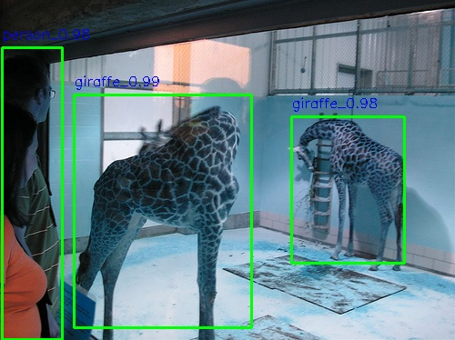
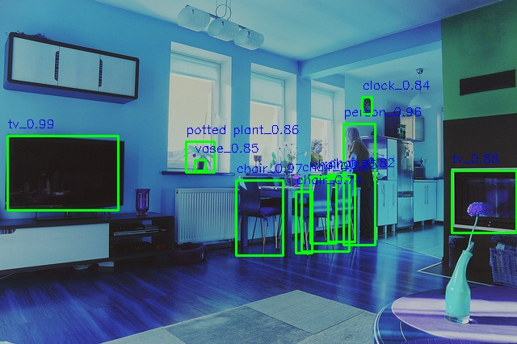
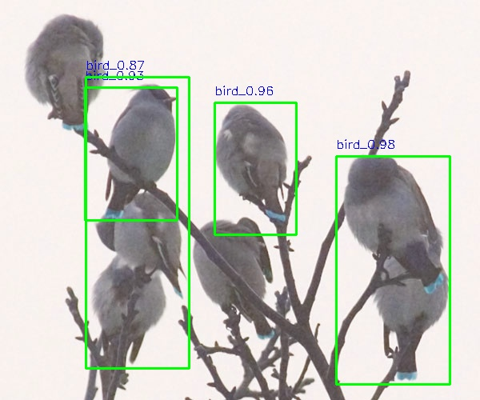
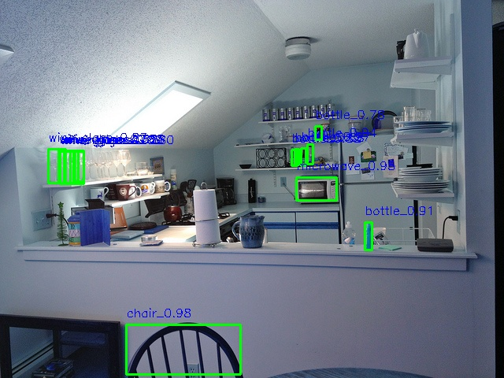
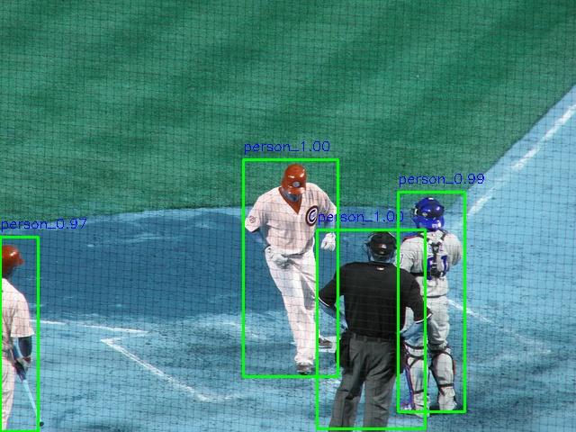

# pytorch_faster_rcnn

Faster RCNN implemented by pytorch, inspired by [maskrcnn-bemchmark](https://github.com/facebookresearch/maskrcnn-benchmark)

## 1 Requirements

- python3.6
- torch>=1.4.0
- torchvision>=0.5.0

## 2 Install

```bash
# 1 下载项目
git clone https://github.com/YohannXu/pytorch_faster_rcnn.git && cd pytorch_faster_rcnn

# 2 修改 coco 数据集路径（第 38-45 行）及 类别数量 (第 157 行)
vim default.py
# cfg.DATASET.TRAIN_ROOT = '/datasets/coco/train2014'
# cfg.DATASET.TRAIN_ANNO = '/datasets/coco/annotations/instances_train2014.json'
# cfg.DATASET.VAL_ROOT = '/datasets/coco/val2014'
# cfg.DATASET.VAL_ANNO = '/datasets/coco/annotations/instances_val2014.json'
# 把上面四行修改成你的数据集所在路径，数据可以在[这里](http://cocodataset.org/#download)下载。
# cfg.ROI_BOX.NUM_CLASSES = 81

# 3 依赖安装（确保已经安装了 gcc）
pip install Cython -i https://pypi.tuna.tsinghua.edu.cn/simple
pip install -r requirements.txt -i https://pypi.tuna.tsinghua.edu.cn/simple
git clone https://github.com/NVIDIA/apex.git
cd apex && pip install -v --no-cache-dir --global-option="--cpp_ext" --global-option="--cuda_ext" ./
cd ..
```

## 3 Usage

```bash
# 训练
python train.py

# 验证
python val.py

# 推断（测试）
python infer.py
```

## 4 训练结果

|   GPU   | backbone | 初始化权重 | 迭代次数 | batch size |  mAP   |
| :-----: | :-----:  | :--------: | :------: | :--------: | :----: |
| RTX2070 | resnet50 |   caffe2   |  90000   |     2      | 26.48% |
| RTX2070 | resnet50 |  pytorch   |  90000   |     2      | 12.80% |

初始化权重为pytorch的训练过程未调参, 所以效果较差。

## 5 测试结果










## 6 TODO

- [ ] 模型剪枝
- [ ] 模型量化
- [ ] TensorRT部署
